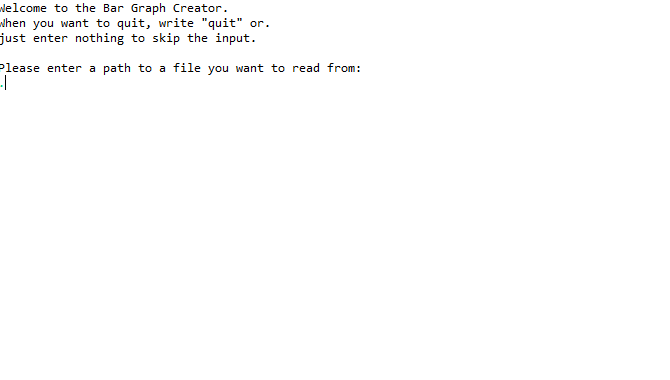
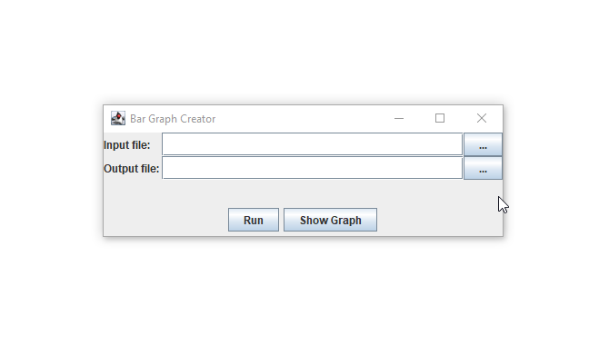

This little project takes text files and counts the characters within.
The counts are then turned into an ASCII file bar graph format.

The initial lab only had a CLI and printed to console.

I extended it to have a GUI and handle Unicode as well.
Taking the old feedbacks from my reports in consideration.

